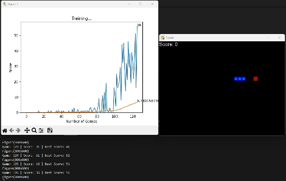

# Snake AI trained with Deep Q-Learning in Python

This project implements the classic snake game using Pygame, along with an agent playing it through reinforcement learning and deep Q-learning, powered by a PyTorch deep neural network.

## Usage

To use the project, follow these steps:

1. Clone the repository to your local machine.
2. Run Agent.py to start the game with the AI agent.
3. Adjust hyperparameters in HyperParameters.py to customize the training process.

### Hyperparameters

- `BLOCK_SIZE`: Dimension of one cell of the game.
- `SPEED`: Length of each clock tick.
- `MAX_MEMORY`: Maximum length of the agent's deque.
- `BATCH_SIZE`: Batch size for long-term training.
- `LR`: Learning rate of the model.
- `EPSILON`: Randomness parameter.
- `GAMMA`: Discount rate.
- `MODEL_FOLDER_PATH`: Folder path for storing trained models.
- `MODEL_NAME`: Name of the .pth file containing the states of the model when it achieved the highest score.
- `LAYERS_SIZES`: List of layer sizes. It can have as many hidden layers as preferred, but the input layer and output layer must have sizes of 11 and 3 respectively.

## Model Description

The deep Q-learning model used in this project is based on a dense neural network architecture implemented using PyTorch. It receives 11 parameters as input, each of which can be either 0 or 1:
- 3 values indicate the presence of an obstacle straight ahead, to the left, or to the right of the snake's head.
- 4 values indicate the direction (only one can be set to 1, indicating the current direction of the snake).
- 4 values indicate the location of the food (whether it is above, below, to the left, or to the right of the snake's head).

The model learns to play the game by optimizing its actions to maximize its cumulative reward over time, using the deep Q-learning algorithm.

## License

This project is open source and available under the [MIT License](LICENSE).
